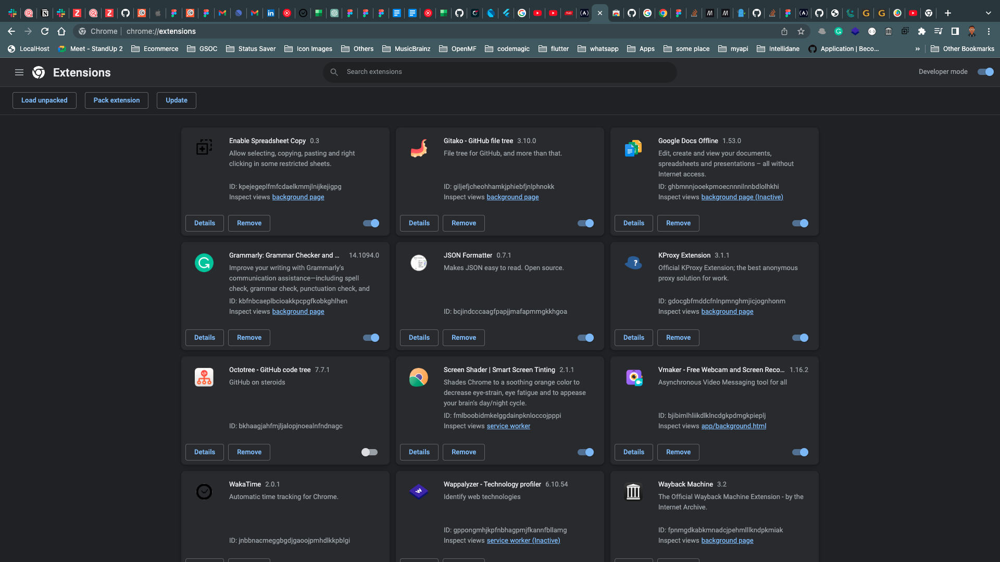

# Pub Manager

[](https://github.com/Mastersam07/pub-manager/blob/master/LICENSE)
[](https://github.com/Mastersam07/pub-manager/pulls)


>>> 🤔🤔🤔 [What do you call someone that works in a pub?](https://twitter.com/mkobuolys/status/1616797891762262016)
>>>
>>> As dart/flutter devs, we visit the "pub" daily. However, we might stumble on some cool package on pub but we arent in need of them at that point.

Pub Manager is an experimental solution to assist with marking a dart/flutter package on pub.dev as favourite.

## 🎖 Installing

This is a chrome extension. At the moment, it is accessible via github releases and would be migrated to the chrome web store in time.

### From Version Control

To add the Pub manager module extension, you need to follow some steps.

1. 
```bash
git clone https://github.com/Mastersam07/pub-manager
```

2. On your chrome browser, navigate to More Tools > Extensions.

3. Enable developer mode and select "Load unpacked". Select the cloned repository/directory

4. Extension successfully installed

### From Extracted Binary

To add the Pub manager module extension, you need to follow some steps.

1. Download from [this link](https://github.com/Mastersam07/pub-manager/releases/tag/v0.1)

2. Head to [crxextrator.com](https://crxextractor.com/).

3. Supply the download *.crx file and extract/get source code. Download and extract source code.

4. On your chrome browser, navigate to More Tools > Extensions.

5. Enable developer mode and select "Load unpacked". Select the extracted source code

6. Extension successfully installed

<br>

<br>

<br>

<br>
<br>

### From Chrome Web Store

```dart
// COMING SOON
```

## 🎮 How To Use

This plugin only works on pub.dev.

1. Visit pub.dev

2. Navigate to any package of choice.

3. Click the add to favourites button.

<br>

<br>

<br>
<br>

## 🐛 Bugs/Requests

If you encounter any problems feel free to open an issue. If you feel the library is
missing a feature, please raise a ticket on Github and I'll look into it.
Pull request are also welcome.

## 🤓 Developer(s)

[](https://mastersam.tech)
#### **Abada Samuel Oghenero**
<p>
<a href="https://twitter.com/mastersam_"></a>
<a href="https://linkedin.com/in/abada-samuel/"></a>
<a href="https://medium.com/@sammytech"></a>
<a href="https://facebook.com/abada.samueloghenero"></a>
</p>

## ⭐️ License

#### <a href="https://github.com/Mastersam07/pub-manager/blob/master/LICENSE">MIT LICENSE</a>
